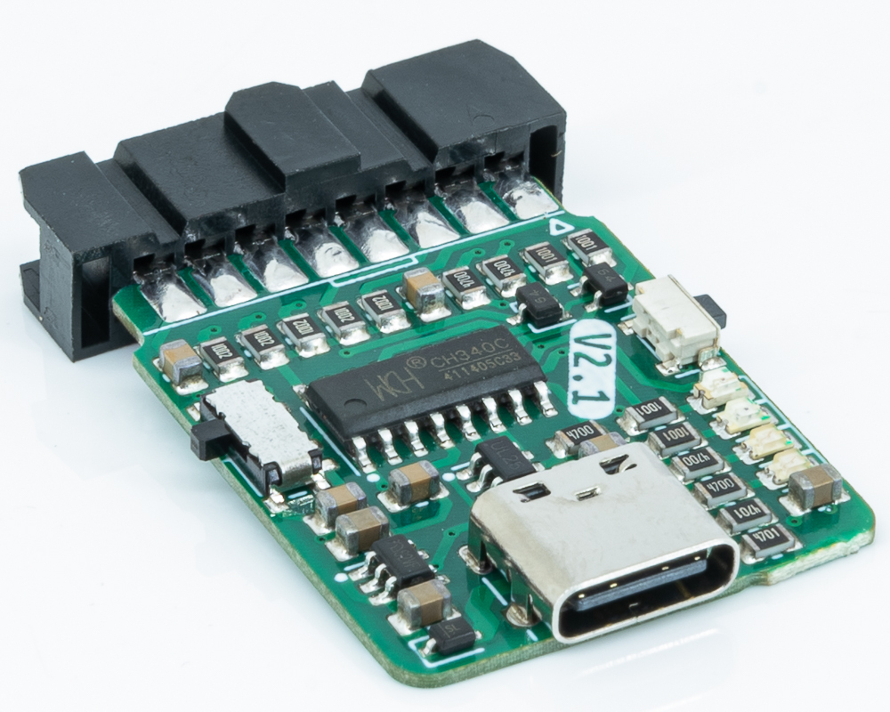
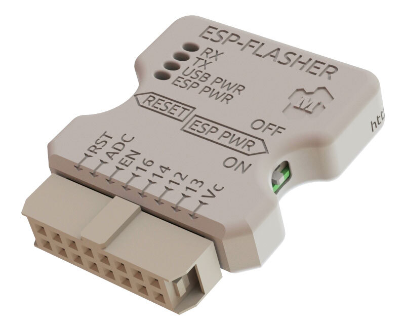
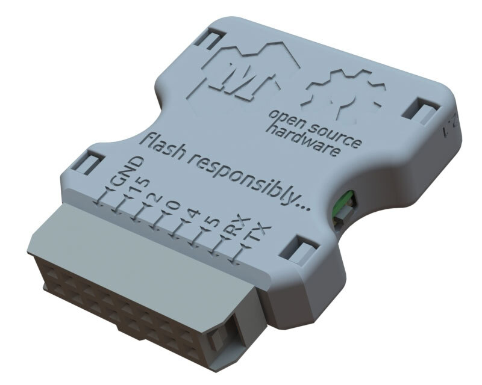

---

This is ESP8266 modular flasher based on CH340 usb uart converter and USB-C port.

* Flashing works with standard `esptool`
* Device can reset ESP automatically
* Device can enter into ESP flashing mode automatically

Support this open-source project - buy your fully assembled and tested flasher [here](http://esp-flasher.makerspace.lt/shop)

For programming and debugging without any onboard provisions in-place use one of these interfaces:

* [ESP-12F interface module](http://esp-12f.makerspace.lt/repo)
* [ESP-01 interface module](http://esp-01.makerspace.lt/repo)

Dev NOTE: before commit, run `./kibot.sh` to regenerate documentation, bom, gerbers and other assets.

* [schematics.pdf](gen/schematics.pdf)
* [pcb.pdf with dimensions](gen/pcb.pdf)
* [ibom.html](gen/single/ibom.html)

---

